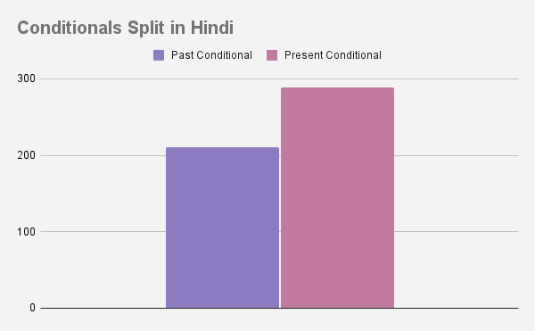
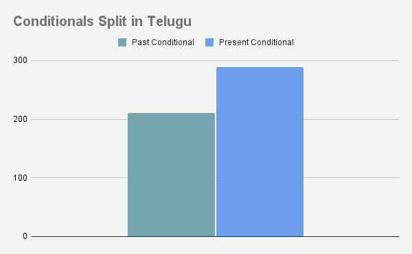

# Language Typology and Universals Project

A computational approach to understanding how conditional clauses work in Telugu and English. Created for the course project of the Spring '21 Course - Language Typology and Universals.
***

## Introduction

**Problem Statement** - Identify and search for patterns in conditional constructions in Hindi and Telugu sentences and compare them with English.
***

## Current Knowledge
Conditional sentences are sentences that express one thing contingent on something else, e.g. "If it rains, the picnic will be cancelled". They are called because the impact of the main clause of the sentence is conditional on the dependent clause. A full conditional thus contains two clauses: the dependent clause expressing the condition, called the antecedent (or protasis); and the main clause expressing the consequence, called the consequent (or apodosis).
***

## Types Of Conditionals

### Zero Conditional
> **Form** - _(If + Present Simple, ... Present Simple)_

> **Example** - If you boil water to hundred degrees, then it boils.

### First Conditional
> **Form** - _(If + Present Simple, will + Infinitive)_

> **Example** - If it rains tomorrow, then we will go to the cinema.

### Second Conditional
> **Form** - _(If + Past Simple, ... would + Infinitve)_

> **Example** - If I had a lot of money, I would travel around the world.

### Third Conditional
> **Form** - _(If + Past Perfect, ... would + have + Past Participle)_

> **Example** - If I had gone to bed early, I would have caught the train.
***

## Literature Review

- [Structure of Hindi Conditional Clauses](https://hindilanguage.info/hindi-grammar/conditional-sentences/)
- [Paper on Hindi Conditional Clauses](https://hal.archives-ouvertes.fr/hal-01377532/file/Sharma-conditionals-hal.pdf)
- [Paper on English Conditional Clause Forms](https://www.sciencedirect.com/science/article/pii/0024384188900629)
- [Paper on English syntax of conditional clauses](https://kb.osu.edu/bitstream/handle/1811/81774/WPL_31_July_1985_130.pdf)
- [Blog on Hindi condtional with examples](https://www.eenglishgrammar.com/2016/11/conditional-sentences-with-examples.html)
***

## Tasks
- [x] Find Dataset of 500 English sentences with conditional clauses.
- [x] Translate the sentences into Hindi and Telugu.
- [x] POS Tagging for Hindi, English, and Telugu sentences.
- [x] Chunk the Telugu sentences. 
- [x] Identity the type of conditional clause according to the rules as seen in **Types of Conditionals**.
- [x] Find patterns and draw graphs to visualise the observations.
- [x] Write the final report.
***

## Directory Structure

The directory structure for the repository is as follows:
``` text
.
├── annotation
│   ├── data
│   │   ├── eng_pos_tags.txt
│   │   ├── Hindi
│   │   │   ├── past.txt
│   │   │   └── present.txt
│   │   ├── hin_pos_tags.txt
│   │   ├── tel_pos_tags.txt
│   │   ├── Type_0
│   │   │   └── eng.txt
│   │   ├── Type_1
│   │   │   └── eng.txt
│   │   ├── Type_2
│   │   │   └── eng.txt
│   │   └── Type_3
│   │       └── eng.txt
│   ├── eng.ipynb
│   ├── eng.py
│   ├── headers.py
│   ├── helper_hindi.py
│   ├── hindi.ipynb
│   ├── hindi.py
│   ├── Telugu_pos.ipynb
│   └── Telugu_POS.py
├── conditional_sentences_telugu.txt
├── data
│   ├── austen-emma.txt
│   ├── austen-persuasion.txt
│   ├── austen-sense.txt
│   ├── bible-kjv.txt
│   ├── blake-poems.txt
│   ├── bryant-stories.txt
│   ├── burgess-busterbrown.txt
│   ├── carroll-alice.txt
│   ├── chesterton-ball.txt
│   ├── chesterton-brown.txt
│   ├── chesterton-thursday.txt
│   ├── edgeworth-parents.txt
│   ├── melville-moby_dick.txt
│   ├── milton-paradise.txt
│   ├── shakespeare-caesar.txt
│   ├── shakespeare-hamlet.txt
│   ├── shakespeare-macbeth.txt
│   └── whitman-leaves.txt
├── dataset_create.py
├── eng_conditional_sentences.txt
├── extra
│   ├── draw_graphs.py
│   └── images
│       ├── Conditionals_Split_in_English.png
│       ├── ConditionalsSplit_in_Hindi.png
│       └── Conditionals_Split_in_Telugu.png
├── final_hindi_sens.txt
├── hin_conditional_sentences.txt
├── LICENSE
├── ProjectPlan.pdf
├── README.md
├── Report.pdf
└── translate_sentences.py
```
***

## Creating The Dataset

The corpus was created by taking sentences from the NLTK corpus of the _Gutenberg Library_. The sentences were then filtered out so taht only sentences that were of the conditional clause format were added.
The code for this can be found in `dataset_create.py`. The list of books from which the data was scraped can be found in the directory `data`.

Code Snippet for converting the data:
``` python
for text in texts:
    f = open('data/' + text, 'r')
    sentences = f.readlines()
    sentences = [sentence.rstrip() for sentence in sentences]
    for tsentence in sentences:
        sentence = list(tsentence.split(" "))
        if sentence[0] == "If":
            final_data.append(tsentence)

f = open('conditional_sentences.txt', 'w')
for sentence in final_data:
    f.write(sentence + '\n')
```
***

## Translation Of The Sentences Into Hindi and Telugu
The sentences were translated using the `google_trans_new` library. This library connects to the Google Translate API and provides a translation into the destination language. The accuracy of the translator was not very good and the sentences that had inaccurate translations were then corrected. The code for the translations can be found in `translate_sentences.py`.

Code Snippet for translating the sentences into Hindi:
``` python
f = open("eng_conditional_sentences.txt", 'r')
sentences = f.readlines()
sentences = [sentence.rstrip() for sentence in sentences]

g = open("final_hindi_sens.txt", 'w')

for sentence in sentences:
    g.write(translator.translate(sentence, lang_src='en', lang_tgt='hi') + '\n')
```
***

## POS Tagging
The POS tagging was done using `Stanza`, a python NLP package, which comes with an in-built POS-Tagger. Each word in every sentence of the dataset was tagged and stored in the format as seen in `engtags` in `annotation/eng.py`. A similar approach was followed for Hindi. The tags along with the tokens and sentences were then stored in `annotation/data/eng_pos_tags.txt`. The output was created by a helped function in `annotation/headers.py`. If the output was inaccurate, it was manually corrected.

Code Snippet for POS tagging sentences in English:
``` python
for sentence in engdata:
    engdoc = nlp(sentence)
    bigtemp = {}
    tokens = []
    for token in engdoc:
        temp = {}
        temp["word"] = token
        temp["POS_TAG"] = token.pos_
        tokens.append(temp)
    bigtemp["word_tags"] = tokens
    engtags.append(bigtemp)
```

Snippet of example output in `annotation/data/eng_pos_tags.txt`:
``` text
4. If he had said it of my wife , you English would yourselves have pardoned me for beating him like a dog in the market place .

TAGS:

	1. If -	SCONJ
	2. he -	PRON
	3. had -	AUX
	4. said -	VERB
	5. it -	PRON
	6. of -	ADP
	7. my -	DET
	8. wife -	NOUN
	9. , -	PUNCT
	10. you -	PRON
	11. English -	PROPN
	12. would -	VERB
	13. yourselves -	NOUN
	14. have -	AUX
	15. pardoned -	VERB
	16. me -	PRON
	17. for -	ADP
	18. beating -	VERB
	19. him -	PRON
	20. like -	SCONJ
	21. a -	DET
	22. dog -	NOUN
	23. in -	ADP
	24. the -	DET
	25. market -	NOUN
	26. place -	NOUN
	27. . -	PUNCT
```
***

## Analysis Of The Conditionals
All the sentences were manually analysed. English sentences were classified into the four categories discussed above. Telugu and Hindi sentences were classified into **past conditionals** and **present conditionals**. This is because of the special sytactic features in the language that will be elaborated on later.

### English
The classified sentences can be found in the respective type in the `data` folder. For example, the _Type 1_ conditionals can be found in `data/Type_1/eng.txt`.
The split can be seen below.

| Type 0 | Type 1 | Type 2 | Type 3 |
|--------|--------|--------|--------|
| 156    | 63     | 203    | 78     |

### Hindi
The classified sentences can be found in the respective type in the `data/Hindi` folder. For example, the _Past Conditionals_ can be found in `data/Hindi/past.txt`.
The split can be seen below.

| Past Conditionals | Present Conditionals |
|--------|--------|
| 211    | 289     |

### Telugu
The classified sentences can be found in the respective type in the `data/Telugu` folder. For example, the _Past Conditionals_ can be found in `data/Telugu/past.txt`.
The split can be seen below.

| Past Conditionals | Present Conditionals |
|--------|--------|
| 211    | 289     |
***

## Observations

### General Splits

**English**


**Hindi**



**Telugu**



### English
- There were more past conditionals than present conditionals.
	- This was because most of the sentences were taken from classic English literature. These texts tend to be written in the past tense.
- There were more simple past and simple present conditionals than present with infinitve and past perfect conditionals.
	- This was because of the fact that the corpus chosen was from classic English literature and it is less likely to be in perfect tenses.
- There were many sentences that were in _Shakesperean English_ and they were converted into sentences in the past tense in English.

### Hindi
- Sentences were classified into past and present conditionals instead of the four types discussed above.
	- This was because there was a loss in translation of the perfect tense aspect when converting into a past or present tense.
	- Similarly, it was hard to find exact Hindi translations of the _Shakesperean English_ and therefore, we had to choose this approach.
- Here, there were more present conditionals rather than past conditionals.
	- This is because of the fact that there was an inherited bias to convert sentences into their present form during the manual translation of these sentences.
- Unlike English, the _first_ word had two options - _अगर_ or _यदि_.

### Telugu
- Sentences were classified into past and present conditionals instead of the four types discussed above.
	- This was because there was a loss in translation of the perfect tense aspect when converting into a past or present tense.
	- Similarly, it was hard to find exact Hindi translations of the _Shakesperean English_ and therefore, we had to choose this approach.
- Here, there were more present conditionals rather than past conditionals.
	- This is because of the fact that there was an inherited bias to convert sentences into their present form during the manual translation of these sentences.
- Unlike English, in Telugu the last part of the conditional needs to be checked if the conditional ends with 'ఉంటే'/ 'స్తే' they would end up in past and 'న్నావ్' / 'నంటే'.
- Conditional clauses in Telugu end in a non-finite form of the verb in which the suffix `tE, TE`is added to the stem.

## Conclusions
The conditionals in Indian languages were harder to analyse than the conditionals in English. This was because of the syntax of the language. Hindi, Telugu, being a free order language had different variations of the same sentence, and it was hard to choose one particular translation. Similarly, the innate bias to convert sentences into their present form while translating ensure that the analyses that we did could be more varied. The fact that our corpus consisted of a lot of Old English led to very interesting constructions which had to be carefully examined before we could place them into a particular category.
Conditional clauses in Telugu end in a non-finite form of the verb in which the suffix `tE, TE` is added to the stem.

We propose, after the work done in this project that condtionals in Indian languages be dealt with in an easier manner than how they are dealt with in English. There is no need for complicating it and splitting into four types. It would be easier to just deal with a **past** and a **present** conditional.
***

## Contributors
> [Tejasvi Chebrolu](https://github.com/tejasvicsr1)

> [Padakanti Srijith](https://github.com/srijith9862)
